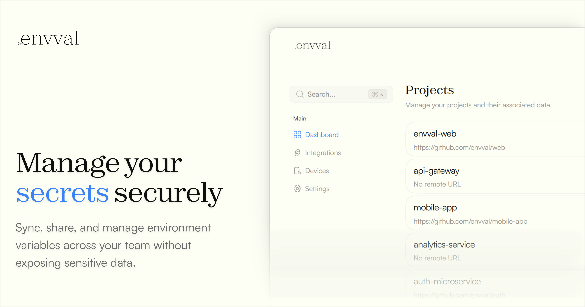
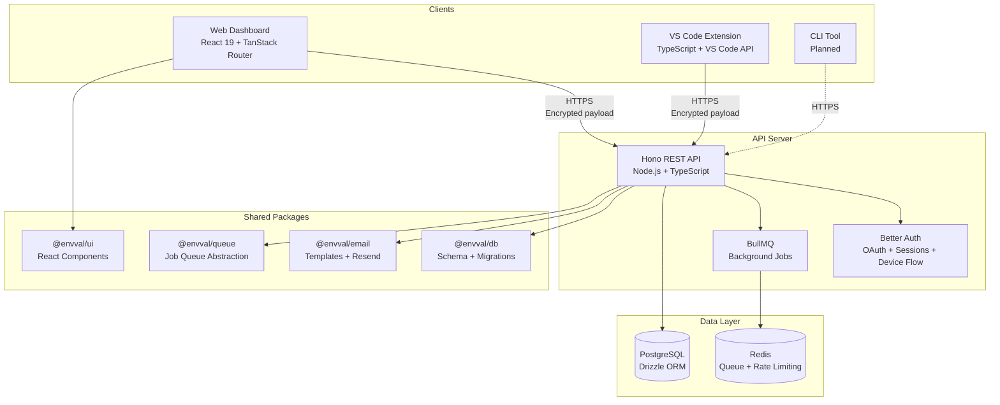
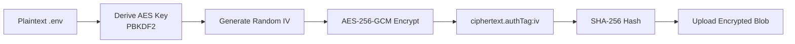

<p align="center">
  
</p>

<h1 align="center">EnvVault</h1>

<p align="center">
  <strong>Zero-knowledge environment variable management — encrypted, synced, everywhere.</strong>
</p>

<p align="center">
  <a href="#features">Features</a> &middot;
  <a href="#architecture">Architecture</a> &middot;
  <a href="#getting-started">Getting Started</a> &middot;
  <a href="#project-structure">Project Structure</a> &middot;
  <a href="#environment-variables">Environment Variables</a> &middot;
  <a href="#development">Development</a> &middot;
  <a href="#deployment">Deployment</a> &middot;
  <a href="#contributing">Contributing</a> &middot;
  <a href="#security">Security</a> &middot;
  <a href="#license">License</a>
</p>

<p align="center">
  <a href="#"></a>
  <a href="#"></a>
  <a href="#"></a>
  <a href="#"></a>
  <a href="#"></a>
  <a href="LICENSE"></a>
</p>

---

<p align="center">
  
</p>

---

## What is EnvVault?

EnvVault is a **zero-knowledge**, **end-to-end encrypted** environment variable manager that keeps your `.env` files secure and synced across your entire team and all your devices. The server **never** sees your plaintext secrets.

It ships as three interconnected surfaces — a **web dashboard**, a **REST API**, and a **VS Code extension** — all orchestrated in a single Turborepo monorepo.

---

## Features

| Feature | Description |
|---------|-------------|
| **End-to-End Encryption** | AES-256-GCM encryption with PBKDF2 key derivation — secrets are encrypted client-side before leaving your machine |
| **Zero-Knowledge Architecture** | The server stores only encrypted blobs; it can never read your environment variables |
| **Cross-Device Sync** | Seamlessly sync `.env` files between your editor, dashboard, and teammates |
| **Device Authorization** | OAuth 2.0 Device Flow (RFC 8628) for secure VS Code extension authentication |
| **Device Isolation** | Each device holds its own RSA-wrapped copy of encryption keys — revoke one without affecting others |
| **Web Dashboard** | Full-featured React 19 UI for managing repositories, environments, and team settings |
| **VS Code Extension** | Inline hover previews, one-click sync, tracked environment tree view, and smart monorepo detection |
| **Transactional Email** | Resend-powered email service with React-based templates and BullMQ background processing |
| **Type-Safe API Client** | Hono RPC client (`hc`) for fully typed frontend-backend communication |

---

## Architecture

EnvVault follows a client-server model where **all cryptographic operations happen on the client**. The API server acts as an encrypted blob store with an authentication and authorization layer.



### Encryption Flow



---

## Getting Started

### Prerequisites

| Tool | Version | Purpose |
|------|---------|---------|
| **Node.js** | >= 18 | Runtime for the API server and build tooling |
| **Bun** | >= 1.2.8 | Workspace package manager |
| **PostgreSQL** | >= 14 | Primary data store |
| **Redis** | >= 6 | Job queue (BullMQ) and rate limiting (Upstash) |
| **VS Code** | >= 1.106 | Required only for extension development |

### Quick Start

```bash
# 1. Clone the repository
git clone https://github.com/Rohit-Singh-Rawat/Env0.git
cd Env0

# 2. Install all dependencies (workspace-aware)
bun install

# 3. Set up environment variables
cp apps/api/.env.example apps/api/.env
# Edit apps/api/.env with your database URL, OAuth credentials, etc.

# 4. Push the database schema
bun run --filter=@envval/db db:push

# 5. Start all services in development mode
bun run dev
```

The web app will be available at `http://localhost:3000` and the API at `http://localhost:8080`.

### Running a Single Service

```bash
# Web dashboard only
bunx turbo dev --filter=web

# API server only
bunx turbo dev --filter=@envval/api

# VS Code extension (watch mode)
cd apps/extension && bun run watch
```

---

## Project Structure

This is a **Turborepo monorepo** with workspaces under `apps/` and `packages/`.

```
envval/
├── apps/
│   ├── web/              # React 19 dashboard (Vite + TanStack Router)
│   ├── api/              # Hono REST API server
│   ├── extension/        # VS Code extension
│   └── email-worker/     # BullMQ email processing worker (Bun)
│
├── packages/
│   ├── db/               # Drizzle ORM schema, migrations, and DB client
│   ├── ui/               # Shared React component library
│   ├── email/            # Email service + React email templates
│   ├── queue/            # BullMQ job queue abstraction (Redis)
│   └── typescript-config/# Shared tsconfig presets
│
├── turbo.json            # Turborepo pipeline configuration
├── package.json          # Root workspace configuration
└── bun.lock              # Bun lockfile
```

### Apps

| App | Stack | Description |
|-----|-------|-------------|
| **`apps/web`** | React 19, Vite 7, TanStack Router/Query, Tailwind CSS 4, Motion, Better Auth | Primary web dashboard for managing repositories, environments, and devices |
| **`apps/api`** | Hono, Drizzle ORM, Better Auth, Zod, Upstash | RESTful API with typed RPC client exports for the frontend |
| **`apps/extension`** | VS Code API, esbuild, Axios | Editor extension with env hover previews, tree view, and device-flow auth |
| **`apps/email-worker`** | BullMQ, Winston, Bun runtime | Background worker that processes the email job queue |

### Packages

| Package | Stack | Description |
|---------|-------|-------------|
| **`@envval/db`** | Drizzle ORM, PostgreSQL (`pg`) | Database schema definitions, migration tooling, and the shared DB client |
| **`@envval/ui`** | React 19 | Shared UI primitives (Button, Card, Code, etc.) used across surfaces |
| **`@envval/email`** | Resend, Zod | Email service abstraction with React-based templates |
| **`@envval/queue`** | BullMQ, ioredis | Redis-backed job queue for async operations (email dispatch, etc.) |
| **`@envval/typescript-config`** | TypeScript 5.9 | Reusable `tsconfig` presets for apps, libraries, and Next.js projects |

---

## Environment Variables

### API Server (`apps/api`)

Create an `.env` file in `apps/api/` with the following:

| Variable | Required | Description |
|----------|----------|-------------|
| `DATABASE_URL` | Yes | PostgreSQL connection string |
| `KEY_MATERIAL_MASTER_KEY` | Yes | 32-byte hex string for server-side envelope encryption |
| `GOOGLE_CLIENT_ID` | Yes | Google OAuth 2.0 client ID |
| `GOOGLE_CLIENT_SECRET` | Yes | Google OAuth 2.0 client secret |
| `GITHUB_CLIENT_ID` | Yes | GitHub OAuth app client ID |
| `GITHUB_CLIENT_SECRET` | Yes | GitHub OAuth app client secret |
| `RESEND_API_KEY` | Yes | Resend API key for transactional email |
| `UPSTASH_REDIS_REST_URL` | Yes | Upstash Redis URL for rate limiting |
| `UPSTASH_REDIS_REST_TOKEN` | Yes | Upstash Redis token |
| `PORT` | No | API server port (default: `8080`) |

### Email Worker (`apps/email-worker`)

| Variable | Required | Description |
|----------|----------|-------------|
| `REDIS_URL` | Yes | Redis connection string for BullMQ |
| `RESEND_API_KEY` | Yes | Resend API key |

---

## Development

### Common Commands

| Action | Command | Description |
|--------|---------|-------------|
| Dev (all) | `bun run dev` | Start all services in watch mode |
| Build (all) | `bun run build` | Production build for all workspaces |
| Type check | `bun run check-types` | Run `tsc --noEmit` across all packages |
| Lint | `bun run lint` | Lint all workspaces |
| Format | `bun run format` | Format all TS/MD files with Prettier |
| DB push | `bun run --filter=@envval/db db:push` | Push schema changes to the database |
| DB studio | `bun run --filter=@envval/db db:studio` | Open Drizzle Studio GUI |
| DB migrate | `bun run --filter=@envval/api db:migrate` | Run database migrations |

### Turbo Tips

- **Filters** respect the dependency graph — `--filter=web...` builds `@envval/ui` first if needed.
- **Caching** is enabled for `build`, `lint`, and `check-types`; deliberately disabled for `dev` to avoid stale hot reloads.
- **Remote caching** — run `bunx turbo login && bunx turbo link` with your Vercel account to share caches across CI.

### Tech Stack Summary

| Layer | Technology |
|-------|-----------|
| Language | TypeScript 5.9 (strict mode) |
| Monorepo | Turborepo 2.x + Bun workspaces |
| Frontend | React 19, Vite 7, TanStack Router/Query, Tailwind CSS 4, Motion |
| Backend | Hono 4.x, Drizzle ORM, PostgreSQL, BullMQ, ioredis |
| Auth | Better Auth (OAuth + session + device flow) |
| Encryption | AES-256-GCM, PBKDF2, RSA-OAEP (Web Crypto API) |
| Email | Resend + React Email templates |
| Extension | VS Code API, esbuild |
| Linting | ESLint 9 + Biome 2.x |
| Formatting | Prettier 3 + Biome |
| Testing | Vitest, @vscode/test-cli |

---

## Deployment

### Web App (`apps/web`)

Deploy the Vite-built SPA to any static host:

```bash
bun run build --filter=web
# Output: apps/web/dist/
```

Recommended hosts: Vercel, Netlify, Cloudflare Pages.

### API Server (`apps/api`)

```bash
bun run build --filter=@envval/api
# Output: apps/api/dist/
# Run: node dist/server.js
```

Recommended hosts: Railway, Fly.io, Render, Vercel Functions.

> **Note:** Set all required environment variables in your deployment target before deploying.

### Email Worker (`apps/email-worker`)

```bash
bun run build --filter=@envval/email-worker
# Output: apps/email-worker/dist/
# Run: bun dist/index.js
```

### VS Code Extension

```bash
cd apps/extension
bun run package          # Produces a .vsix file
# Publish: vsce publish
```

### Deployment Checklist

- [ ] `bun run build` succeeds locally with no errors
- [ ] `bun run check-types` passes
- [ ] All required environment variables are configured in the deploy target
- [ ] Database migrations are applied (`db:migrate` or `db:push`)
- [ ] Redis is accessible for queue processing and rate limiting
- [ ] Extension version is bumped before marketplace upload

---

## Contributing

Contributions are welcome. Whether it is a bug fix, feature, or documentation improvement — we appreciate it.

### How to Contribute

1. **Fork** the repository
2. **Create a feature branch**: `git checkout -b feat/your-feature-name`
3. **Install dependencies**: `bun install`
4. **Make your changes** and ensure they pass:
   ```bash
   bun run check-types   # Type safety
   bun run lint          # Code quality
   bun run build         # Build integrity
   ```
5. **Commit** using [Conventional Commits](https://www.conventionalcommits.org/):
   ```
   feat: add environment variable search
   fix: resolve device auth token refresh
   docs: update API endpoint reference
   ```
6. **Open a Pull Request** with:
   - A clear description of the change
   - Screenshots or screencasts for UI changes
   - Sample API responses for endpoint changes

### Development Guidelines

- **TypeScript** — Use strict typing everywhere. Avoid `any`.
- **Components** — Add shared components to `packages/ui`; keep app-specific components local.
- **API routes** — Follow the existing `modules/` pattern with `*.handler.ts`, `*.service.ts`, and `*.schema.ts`.
- **Tests** — Add tests when touching API routes or UI logic. Use Vitest for web, `@vscode/test-cli` for the extension.
- **Commits** — Keep them atomic and well-scoped. One logical change per commit.

---

## Security

EnvVault takes security seriously. The entire system is built on a **zero-knowledge architecture** — the server never has access to plaintext secrets.

### Security Model

| Threat | Mitigation |
|--------|-----------|
| Server database breach | Key material is encrypted at rest using envelope encryption |
| Network interception | HTTPS + RSA-OAEP wrapped key material |
| Device compromise | Per-device key wrapping; revoke one device without affecting others |
| Replay attacks | Short-lived JWTs (15 min) + session validation |
| Key material leak | Master key rotation re-encrypts all user key materials |

### Reporting Vulnerabilities

**Please do NOT open a public GitHub issue for security vulnerabilities.**

If you discover a security vulnerability, please report it responsibly by emailing **security@envvault.io** (or contacting the maintainer directly). We will acknowledge receipt within 48 hours and work on a fix promptly.

---

## Roadmap

- [ ] CLI tool for CI/CD pipeline integration
- [ ] Team sharing and role-based access control
- [ ] Environment version history and rollback
- [ ] Key rotation mechanism
- [ ] Self-hosted deployment option (Docker Compose)
- [ ] Web app device registration with RSA keypair
- [ ] Audit logs for environment access

---

## Community

- [Report a Bug](https://github.com/Rohit-Singh-Rawat/Env0/issues/new?template=bug_report.md)
- [Request a Feature](https://github.com/Rohit-Singh-Rawat/Env0/issues/new?template=feature_request.md)
- [Discussions](https://github.com/Rohit-Singh-Rawat/Env0/discussions)

---

## License

This project is licensed under the [MIT License](LICENSE).

---

<p align="center">
  Built by <a href="https://github.com/Rohit-Singh-Rawat">Rohit Singh Rawat</a>
</p>
