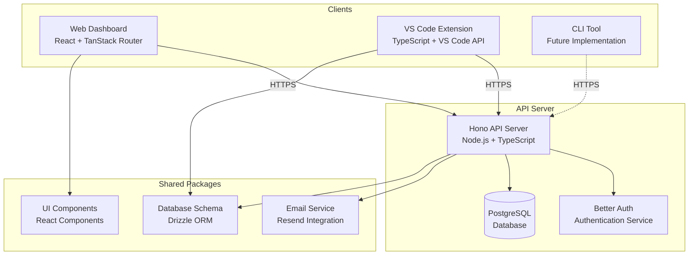
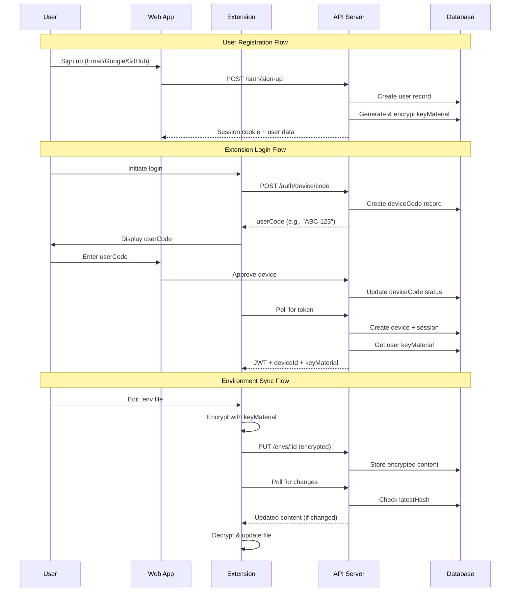
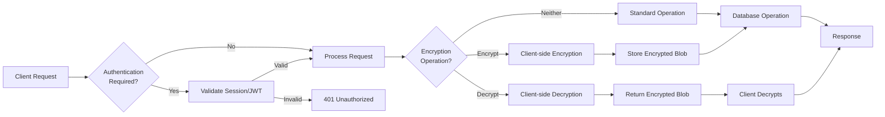
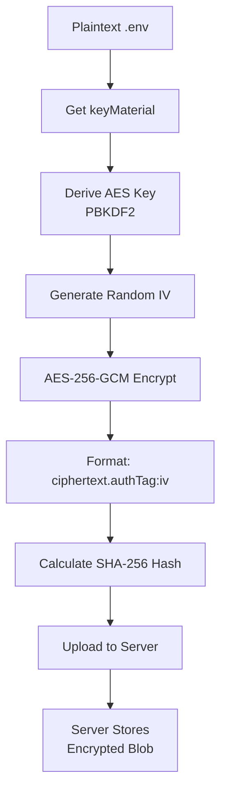
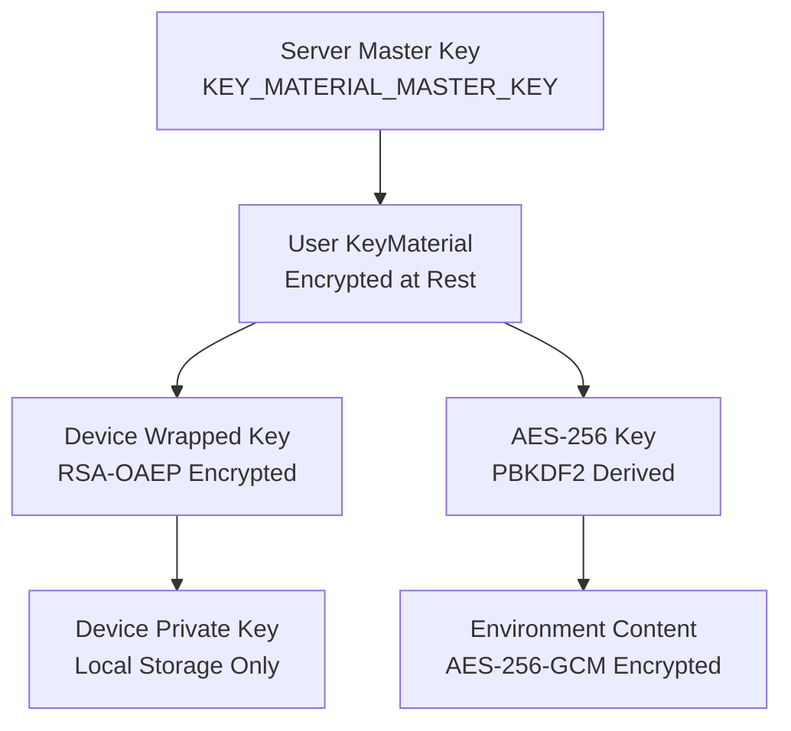

# System Architecture

## High-Level Overview

EnvVault follows a client-server architecture with three main client surfaces and a centralized API server. All environment variable data is encrypted client-side before transmission, ensuring the server never has access to plaintext secrets.



## Component Interaction Flow



## Technology Stack

### Web Application (`apps/web`)

- **Framework**: React 19 with TanStack Router
- **State Management**: TanStack Query (React Query)
- **Authentication**: Better Auth (React client)
- **Styling**: Custom CSS with design system
- **Build Tool**: Vite

### VS Code Extension (`apps/extension`)

- **Language**: TypeScript
- **Runtime**: Node.js (VS Code extension host)
- **Storage**: VS Code SecretStorage API + local JSON files
- **Build Tool**: esbuild
- **File Watching**: VS Code FileSystemWatcher API

### API Server (`apps/api`)

- **Framework**: Hono (lightweight web framework)
- **Authentication**: Better Auth (server)
- **Database**: PostgreSQL with Drizzle ORM
- **Email**: Resend (via shared email package)
- **Runtime**: Node.js

### Shared Packages

- **`packages/db`**: Drizzle ORM schema and migrations
- **`packages/ui`**: Shared React components (Button, Card, Code)
- **`packages/email`**: Email service abstraction (Resend provider)
- **`packages/queue`**: Background job queue (Redis-based)
- **`packages/typescript-config`**: Shared TypeScript configurations

## Data Flow Architecture

### Request Flow



### Encryption Flow



## Network Architecture

### API Endpoints Structure

```
/api
├── /auth
│   ├── /session          # Session management
│   ├── /extension        # Extension-specific auth
│   └── /device           # Device authorization
└── /v1
    ├── /onboarding       # User onboarding
    ├── /repos            # Repository management
    └── /envs             # Environment CRUD (planned)
```

### Authentication Methods

- **Web App**: Cookie-based sessions (Better Auth)
- **Extension**: JWT tokens (15-minute expiry)
- **Device Authorization**: OAuth 2.0 Device Flow (RFC 8628)

## Security Architecture

### Key Hierarchy



### Threat Model

| Threat               | Mitigation                                          |
| -------------------- | --------------------------------------------------- |
| Server DB breach     | KeyMaterial encrypted at rest (envelope encryption) |
| Network interception | HTTPS + wrapped keyMaterial (RSA-OAEP)              |
| Device compromise    | Device revocation; other devices unaffected         |
| Replay attacks       | JWT expiry (15min) + session validation             |
| Man-in-the-middle    | HTTPS + certificate pinning (optional)              |
| KeyMaterial leak     | Rotate master key; re-encrypt all user keyMaterials |

## Deployment Architecture

### Development

- All services run locally
- Shared PostgreSQL database
- Hot reload enabled for all services

### Production (Planned)

- Web app: Static hosting (Vercel/Netlify)
- API server: Node.js runtime (Railway/Fly.io)
- Database: Managed PostgreSQL
- Extension: VS Code Marketplace

## Scalability Considerations

### Current Limitations

- Single database instance
- No caching layer
- Synchronous encryption operations
- No rate limiting

### Future Improvements

- Redis caching for sessions
- Background job queue for heavy operations
- CDN for static assets
- Database read replicas
- Rate limiting middleware


