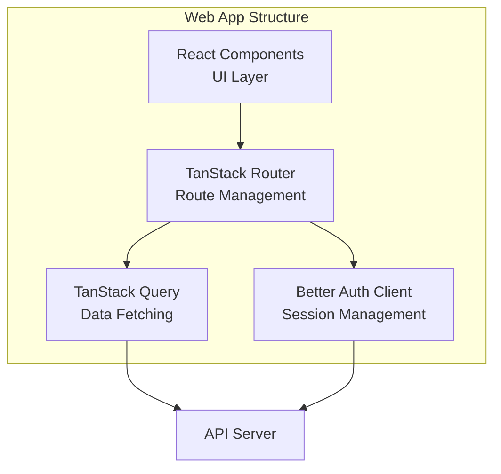
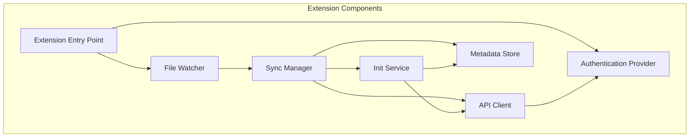
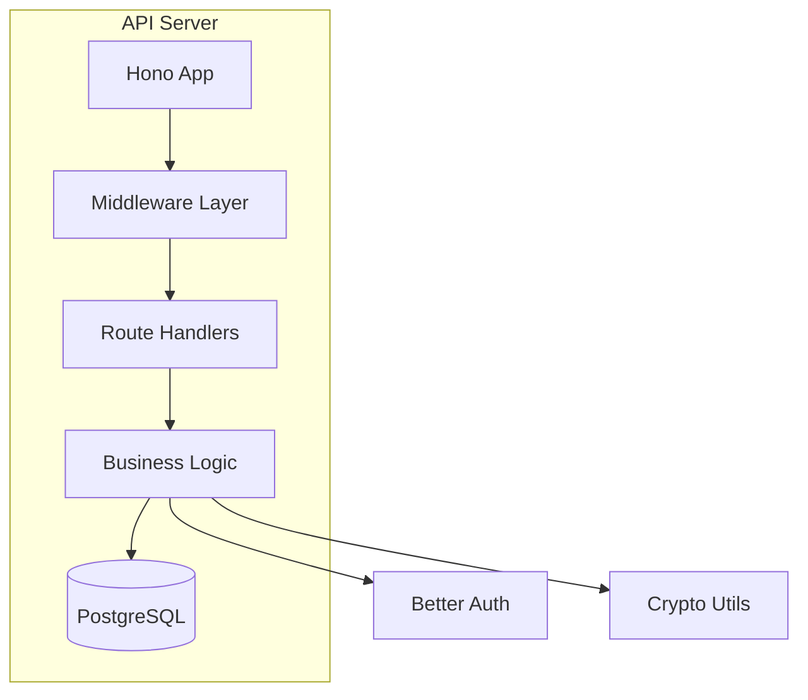

# System Components

## Web Application (`apps/web`)

### Purpose

The web dashboard provides a user-friendly interface for managing environment variables, viewing repositories, and managing devices. It serves as the primary interface for onboarding new users and approving extension devices.

### Key Features

- User authentication (email/OTP, Google, GitHub)
- Repository management
- Environment variable viewing/editing (planned)
- Device management and revocation
- Onboarding flow

### Architecture

### Key Modules

#### Authentication (`src/lib/auth-client.ts`)

- Better Auth React client configuration
- JWT and session management
- Device authorization support

#### Routes

- `/` - Home page (public)
- `/login` - Authentication page
- `/welcome` - Onboarding flow
- `/dashboard` - Main dashboard (protected)
  - `/dashboard/repos` - Repository list
  - `/dashboard/device` - Device management

#### State Management

- TanStack Query for server state
- React state for UI state
- Better Auth for authentication state

### Storage

- **Sessions**: HTTP-only cookies (managed by Better Auth)
- **KeyMaterial**: Not yet implemented (should use IndexedDB with RSA keypair)

### Current Status

- ✅ Authentication working
- ✅ Onboarding flow implemented
- ✅ Repository listing
- ❌ Environment variable editing (not implemented)
- ❌ Device registration with RSA keypair (not implemented)

---

## VS Code Extension (`apps/extension`)

### Purpose

The extension integrates EnvVault directly into the VS Code development workflow, automatically syncing `.env` files between local workspace and encrypted cloud storage.

### Key Features

- Automatic `.env` file detection
- Real-time sync on file changes
- Conflict detection and resolution
- Device authorization flow
- Background polling for remote changes

### Architecture

### Key Services

#### Authentication Provider (`src/providers/auth-provider.ts`)

- Device authorization flow (OAuth 2.0 Device Flow)
- Token polling with exponential backoff
- Session management
- Logout functionality

**Flow**:

1. Request device code from server
2. Display user code to user
3. Poll server for approval
4. Receive JWT token + keyMaterial
5. Store credentials in SecretStorage

#### File Watcher (`src/watchers/env-file-watcher.ts`)

- Monitors workspace for `.env` file changes
- Emits events on create, update, delete
- Filters for standard env file patterns

#### Sync Manager (`src/watchers/env-sync-manager.ts`)

- Handles file save events
- Encrypts and uploads changes
- Polls server for remote changes
- Detects and resolves conflicts

**Sync Flow**:

1. File saved → Read content
2. Calculate hash → Compare with last synced hash
3. If changed → Encrypt → Upload
4. Update metadata with new hash

#### Init Service (`src/services/env-init.ts`)

- Handles first-time file detection
- Prompts user for initialization/restore
- Manages three-way merge scenarios:
  - Local exists, remote doesn't → Initialize
  - Remote exists, local doesn't → Restore
  - Both exist → First-time sync with conflict detection

#### Metadata Store (`src/services/metadata-store.ts`)

- Tracks synced environment files
- Stores last synced hash per file
- Persists to VS Code workspace storage

### Storage

- **Access Token**: VS Code SecretStorage
- **Device ID**: VS Code SecretStorage
- **KeyMaterial**: VS Code SecretStorage
- **Device Private Key**: VS Code SecretStorage + `~/.envvault/device.json`
- **Metadata**: VS Code workspace storage (JSON files)

### Current Status

- ✅ Device authorization flow working
- ✅ File watching implemented
- ✅ Sync on save working
- ✅ Polling for remote changes
- ✅ Conflict detection
- ⚠️ Key derivation uses `deviceId` instead of `userId` (breaks cross-device sync)
- ❌ Device RSA keypair generation (not implemented)

---

## API Server (`apps/api`)

### Purpose

The API server provides REST endpoints for authentication, repository management, and environment variable storage. It never sees plaintext environment variables.

### Key Features

- User authentication (Better Auth)
- Device management
- Repository CRUD operations
- Environment variable storage (encrypted blobs only)
- Session management

### Architecture

### Key Modules

#### Authentication Service (`src/modules/auth/auth.service.ts`)

- Better Auth server configuration
- OAuth providers (Google, GitHub)
- Email OTP authentication
- Device authorization plugin
- Custom session hooks

**Session Types**:

- `SESSION_WEB`: Cookie-based web sessions
- `SESSION_EXTENSION`: JWT-based extension sessions

#### Device Service (`src/modules/auth/device.service.ts`)

- Device record management
- Device creation/updates
- Device metadata tracking

#### Extension API (`src/api/auth/extension.api.ts`)

- Custom device token endpoint
- Device ID generation
- Key material provisioning (currently incomplete)

**Current Issue**: Key material generation is not properly stored/retrieved. It generates a new key each time instead of using stored encrypted keyMaterial.

#### Repository Service (`src/modules/repo/`)

- Repository CRUD operations
- Environment listing (planned)
- Repository metadata

### Middleware

#### Session Middleware (`src/shared/middleware/session.middleware.ts`)

- Validates sessions for protected routes
- Extracts user/device information
- Handles session expiry

#### Error Middleware (`src/shared/middleware/error.middleware.ts`)

- Global error handling
- Standardized error responses
- Logging

#### CORS (`src/config/cors.ts`)

- Configures allowed origins
- Handles preflight requests

### Current Status

- ✅ Authentication working
- ✅ Device authorization flow
- ✅ Repository CRUD
- ⚠️ Key material storage incomplete (generates new each time)
- ❌ Environment CRUD endpoints (not fully implemented)
- ❌ Key material encryption/decryption with master key (schema exists but not used)

---

## Shared Packages

### Database Package (`packages/db`)

**Purpose**: Centralized database schema and migrations

**Key Tables**:

- `user`: User accounts with encrypted keyMaterial
- `session`: Active user sessions
- `device`: Registered devices per user
- `repo`: Git repositories
- `environment`: Encrypted environment files
- `deviceCode`: Device authorization codes
- `auditLog`: Audit trail (planned usage)

**Schema Features**:

- Drizzle ORM schema definitions
- Type-safe queries
- Migration system
- Relations defined

### UI Package (`packages/ui`)

**Purpose**: Shared React components across web app

**Components**:

- `Button`: Reusable button component
- `Card`: Card container component
- `Code`: Code display component

### Email Package (`packages/email`)

**Purpose**: Email service abstraction

**Features**:

- Resend provider implementation
- Email templates (OTP, welcome)
- Idempotency support
- Type-safe email sending

### Queue Package (`packages/queue`)

**Purpose**: Background job processing

**Status**: Basic structure exists, not fully implemented

**Planned Usage**:

- Email sending
- Key rotation jobs
- Audit log processing

---

## Component Communication

### Web ↔ API

- **Protocol**: HTTPS
- **Auth**: Cookie-based sessions
- **Data Format**: JSON
- **Real-time**: Polling (no WebSocket currently)

### Extension ↔ API

- **Protocol**: HTTPS
- **Auth**: JWT tokens
- **Data Format**: JSON
- **Real-time**: Polling (configurable interval)

### Shared State

- Database schema shared via `packages/db`
- Type definitions shared via TypeScript project references
- API types generated via Hono RPC (planned)
